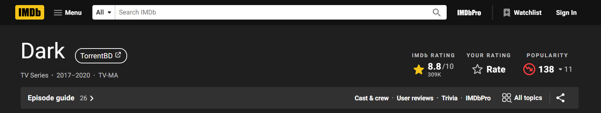

# IMDB to TorrentBD - Chrome Extension
This extension will add a link to TorrentBD on TV Series/Movie's IMDB page. 

*N.B: This extension only works with the new version of IMDB*

## How to Install
- Clone or Download this repository as zip.
- Extract the downloaded zip file.
- Open Google Chrome/other Chromium based browser.
- Open **Extensions** page (For chrome-> chrome://extensions/) on your browser.
- Enable **Developer Mode** toggle.
- Click on **Load Unpacked** and browse for the extracted folder of the extension. Finally select the folder. Extension will be loaded into browser.

## Bug Report/Feature Suggestion
Create an Issue on this repository.